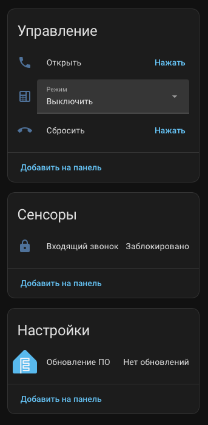
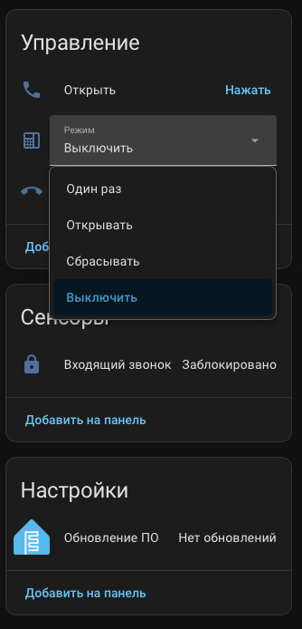

# 🏠 Умный домофон на ESP32‑C6 и Thread

Проект для ESPHome, превращающий обычный аналоговый домофон в устройство, управляемое из Home Assistant.
---
## ✨ Возможности

- **Обнаружение входящего звонка** через оптопару (вход GPIO3 с подтяжкой).
- **Две коммутирующие оптопары**:
  - «Дежурный режим» (GPIO1) – имитирует положенную трубку.
  - «Ответ / Открытие двери» (GPIO4) – имитирует поднятие трубки и нажатие кнопки открытия.

- **Четыре режима работы**, переключаемые из Home Assistant:
  - `Выключить` – только ручное управление.
  - `Один раз` – ответить и открыть на следующий звонок, затем отключиться.
  - `Открывать` – всегда отвечать и открывать дверь.
  - `Сбрасывать` – всегда сбрасывать звонок.
- **Ручные кнопки** в интерфейсе HA для открытия двери и сброса звонка.
- **Гибкая настройка временных задержек** под конкретную модель домофона.
- **Поддержка Thread** (OpenThread) и IPv6 – готовность к Matter.
- **OTA‑обновления** и шифрование API.
---
## 📦 Аппаратные компоненты

| Компонент             | Назначение                                                                  |
|-----------------------|-----------------------------------------------------------------------------|
| ESP32‑C6              | Контроллер с Wi‑Fi 6, Bluetooth 5, Thread.                                  |
| Оптопара KAQY212S     | Твердотельные реле (нормально разомкнутые) для гальванической развязки.     |
| Резисторы 220 Ом      | Для ограничения тока светодиодов оптопар (подбирается под напряжение GPIO). |
| Блок питания 5 В      | Питание ESP32‑C6.                                                           |

> 💡 **Почему KAQY212S?**  
> Микросхема содержит MOSFET‑выход с двунаправленным ключом, выдерживает до 60 В и 400 мА, идеально подходит для коммутации сигналов аналоговых домофонов (как постоянного, так и переменного тока). Полная гальваническая развязка исключает влияние помех и защищает ESP.
---

## 🔌 Схема подключения

Конфигурация ESPHome использует следующие GPIO (можно изменить в секции `substitutions`):

| GPIO ESP32‑C6 | Функция                           | Подключение оптопары / сигнала                                                                                  |
|---------------|-----------------------------------|-----------------------------------------------------------------------------------------------------------------|
| **GPIO1**     | Управление оптопарой «Standby»    | Анод светодиода оптопары через резистор 220–470 Ом к GPIO1, катод – на GND. Выход (4 и 6) – параллельно трубке.  |
| **GPIO3**     | Вход детектора звонка             | Выходные контакты оптопары (4 и 6) подключаются параллельно динамику вызова. Светодиод оптопары – через резистор к линии звонка. На входе GPIO3 включена внутренняя подтяжка `INPUT_PULLUP`. |
| **GPIO4**     | Управление оптопарой «Ответ»      | Анод светодиода оптопары через резистор к GPIO4, катод – на GND. Выход (4 и 6) – параллельно кнопке открытия двери / контакту ответа. |

### Логика работы выходов

- **Оптопара «Standby» (GPIO1)** – в обычном состоянии включена (`output.turn_on`), её контакты замкнуты, что соответствует «положенной трубке». При ответе или сбросе она кратковременно выключается.
- **Оптопара «Ответ» (GPIO4)** – нормально выключена. Включается на время имитации поднятия трубки или открытия двери.

### Детектор звонка

Третья оптопара подключается к линии вызывного динамика. При появлении сигнала звонка (переменное или постоянное напряжение) светодиод оптопары загорается, выходные контакты замыкаются, притягивая GPIO3 к GND. В прошивке используется инвертированный вход (`inverted: True`), поэтому замыкание контактов воспринимается как **нажатие** (`on_press`).

---

## 🏡 Интеграция с Home Assistant

В HA появятся сущности:

- **Select «Режим»** – переключение режимов автоматизации.
- **Binary Sensor «Входящий звонок»** – состояние звонка.
- **Кнопки «Открыть»** и **«Сбросить»** – ручное управление.

Все элементы доступны на карточке устройства ESPHome.

---

## ⚙️ Настройка временных параметров

В блоке `substitutions` можно тонко настроить тайминги:

| Параметр                   | Значение по умолчанию | Описание                                                                          |
|----------------------------|-----------------------|-----------------------------------------------------------------------------------|
| `call_end_detect_delay`    | `3000ms`              | Минимальная длительность импульса звонка для надёжного обнаружения.                |
| `before_answer_delay`      | `10ms`                | Задержка перед началом ответа (позволяет линии стабилизироваться).                 |
| `answer_on_time`           | `1500ms`              | Длительность удержания «поднятой трубки».                                          |
| `open_on_time`             | `600ms`               | Длительность импульса открытия двери (нажатия кнопки).                             |
| `after_open_delay`         | `500ms`               | Дополнительная пауза после открытия перед возвратом в дежурный режим.              |

---

## 🐞 Диагностика и возможные проблемы

- **Звонок не определяется**:
  - Убедитесь, что в конфигурации GPIO3 стоит `inverted: True` (активный уровень – низкий).
- **Дверь не открывается**:
  - Увеличьте `open_on_time` (например, до `800ms`).
  - Проверьте, что оптопара «Ответ» действительно замыкает контакты кнопки (мультиметром в режиме прозвонки).
- **Режимы переключаются, но автоматика не срабатывает**:
  - Включите логи ESPHome и убедитесь, что сенсор `incoming_call` переходит в `on` при звонке.
  - Проверьте, что выбранный режим соответствует ожидаемому поведению (особенно «Один раз»).

---

## 🧵 Thread и IPv6

Устройство настроено как **Full Thread Device** (FTD) и будет пытаться присоединиться к существующей Thread‑сети, используя TLV из `secrets.yaml`.

---

### 📸 Screenshots

## 📄 License

MIT © 2026 [F-Lab]
Made with ❤️ by f1x6r
